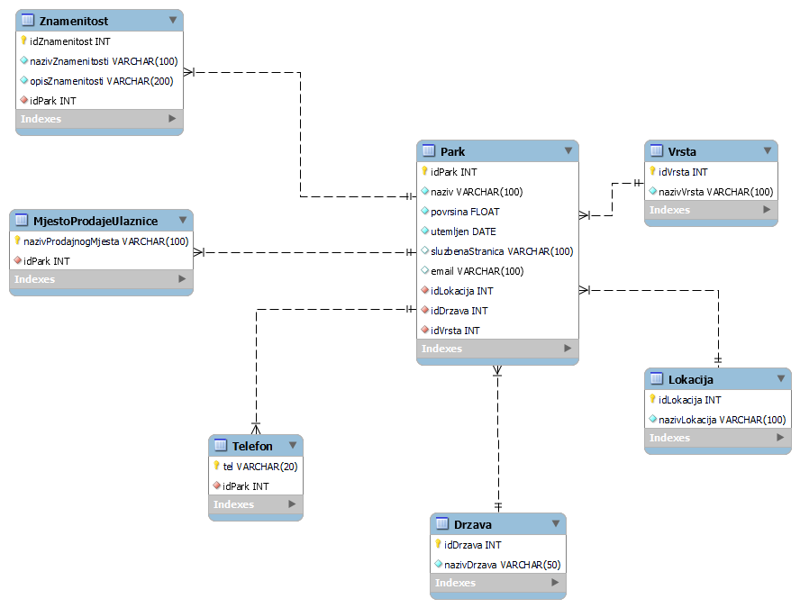

# ParkoviPrirodeDataSet
Nacionalni parkovi i parkovi prirode dataset. Ovo je Otvoreni skup podataka koji sadrži informacije o parkovima prirode i nacionalnim parkovima. Informacije koje sadrži su naziv parka, kontaktne informacije kao telefonski brojevi i email, lokaciju parka te neke znamenitosti u parku odnosno atrakcije.

## Informacije
- **Autor:** Mihael Petričević
- **Jezik skupa podataka:** Hrvatski / Croatian
- **Licenca:** [MIT](./LICENSE)
- **Formati:** [CSV](./parkovi_prirode.csv), [JSON](./parkovi_prirode.json)
- **Encoding:**: UTF-8
- **Trenutna verzija skupa podataka:** 1.0.0
- **Zadnje ažurirano**: 1.11.2022.
- **Orginalno napravljeno**: 1.11.2022.
- **Baza Podataka**: [PostgreSQL](https://www.postgresql.org/)
- **Verzija PostgreSQL**: 15.0

## Opis baze podataka


# Opis podataka
| Naziv atributa       | Opis                                                             |
|----------------------|------------------------------------------------------------------|
| idPark               | Jedinstvena šifra za Park Prirode                                |
| naziv                | Naziv Parka Prirode                                              |
| povrsina             | Površina Parka u km^2                                            |
| utemeljen            | Datum kada je postao Park Prirode u YEAR-MONTH-DAY formatu       |
| sluzbenaStranica     | URL službene stranice                                            |
| email                | Email za kontakt Parka Prirode                                   |
| nazivLokacija        | Naziv lokacije gdje se nalazi Park Prirode                       |
| nazivVrsta           | Koje vrste je, npr. Park Prirode ili Nacionalni Park             |
| tel                  | Kontaktni broj parka (može ih biti više)                         |
| nazivProdajnogMjesta | Naziv mjesta gdje se mogu kupiti karte za ulaz u Park Prirode    |
| nazivDrzava          | Naziv drzave u kojoj se nalazi Park Prirode                      |
| nazivZnamenitosti    | Naziv neke znamenitosti unutar Parka Prirode (može ih biti više) |
| opisZnamenitosti     | opis neke znamenitosti u Parku Prirode                           |

## Export baze u JSON
U konzoli upisati
```bash
    psql -U postgres
```
Unijeti lozinku postgres korisnika te zatim unijeti:

```bash
SET client_encoding = 'UTF8';
\t
\a
\o parkovi_prirode.json
SELECT json_agg(row_to_json(t)) FROM (
    
    SELECT outerPark.idPark, naziv, povrsina, utemeljen, sluzbenaStranica, email, nazivLokacija, nazivDrzava,
    
        (SELECT json_agg(row_to_json(telArray))
            FROM (SELECT tel FROM Telefon NATURAL JOIN Park AS innerPark WHERE innerPark.idPark = outerPark.idPark) AS telArray
        ) AS Telefon, nazivVrsta,	
    
        (SELECT json_agg(row_to_json(mjestoProdajeArray))
            FROM (SELECT nazivProdajnogMjesta FROM MjestoProdajeUlaznice NATURAL JOIN Park AS innerPark WHERE innerPark.idPark = outerPark.idPark) AS mjestoProdajeArray
        ) AS MjestoProdajeUlaznice,
    
        (SELECT json_agg(row_to_json(znamenitostArray))
            FROM (SELECT nazivZnamenitosti, opisZnamenitosti FROM Znamenitost NATURAL JOIN Park AS innerPark WHERE innerPark.idPark = outerPark.idPark) AS znamenitostArray
        ) AS Znamenitost
    
    FROM Park AS outerPark NATURAL JOIN Lokacija NATURAL JOIN Drzava NATURAL JOIN Vrsta ORDER BY outerPark.idPark ASC
    
) AS t;
\o
\q
```
Trebala bi se stvoriti datoteka parkovi_prirode.json

## Export baze u CSV
U konzoli upisati
```bash
    psql -U postgres
```
Unijeti lozinku postgres korisnika te zatim unijeti:
```bash
SET client_encoding = 'UTF8';
\copy (SELECT p.idPark, naziv, povrsina, utemeljen, sluzbenaStranica, email, nazivLokacija, nazivDrzava, tel, nazivVrsta, nazivProdajnogMjesta, Znamenitost.nazivZnamenitosti, Znamenitost.opisZnamenitosti FROM Park AS p NATURAL JOIN Lokacija NATURAL JOIN Drzava NATURAL JOIN Vrsta LEFT JOIN Telefon ON p.idPark = Telefon.idPark LEFT JOIN MjestoProdajeUlaznice ON p.idPark = MjestoProdajeUlaznice.idPark LEFT JOIN Znamenitost ON p.idPark = Znamenitost.idPark ORDER BY p.idPark ASC) TO './parkovi_prirode.csv' DELIMITER ',' CSV HEADER;
\q
```
Trebala bi se stvoriti datoteka parkovi_prirode.csv

## Dodatno
U mapi dodatno se nalazi bazaPostgres.sql koja sadrži sve naredbe za kreiranje i popunjavanje baze.  
  
Dump stvoren pomoću komande
```bash
pg_dump -U postgres > dump.sql
```